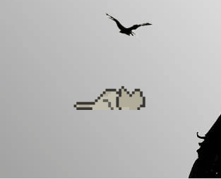
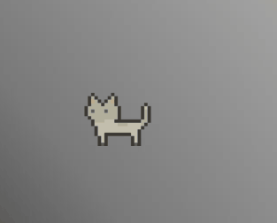

# 🐱 Desktop Pet

A simple animated desktop pet built with Python and Tkinter.

## Features

- Animated GIF-based character  
- Random walking, running, idle, and sleeping states  
- Drag and drop interaction  
- Right-click to trigger angry mode  
- Periodic reminder sound  
- Always-on-top transparent window  

## Technologies Used

- Python  
- Tkinter  
- winsound

## Preview




## Run

```bash
python main.py
